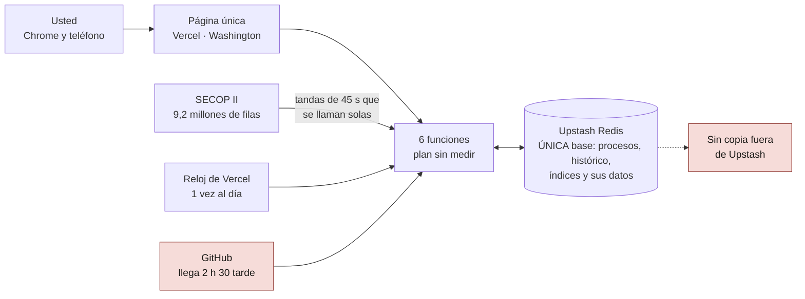
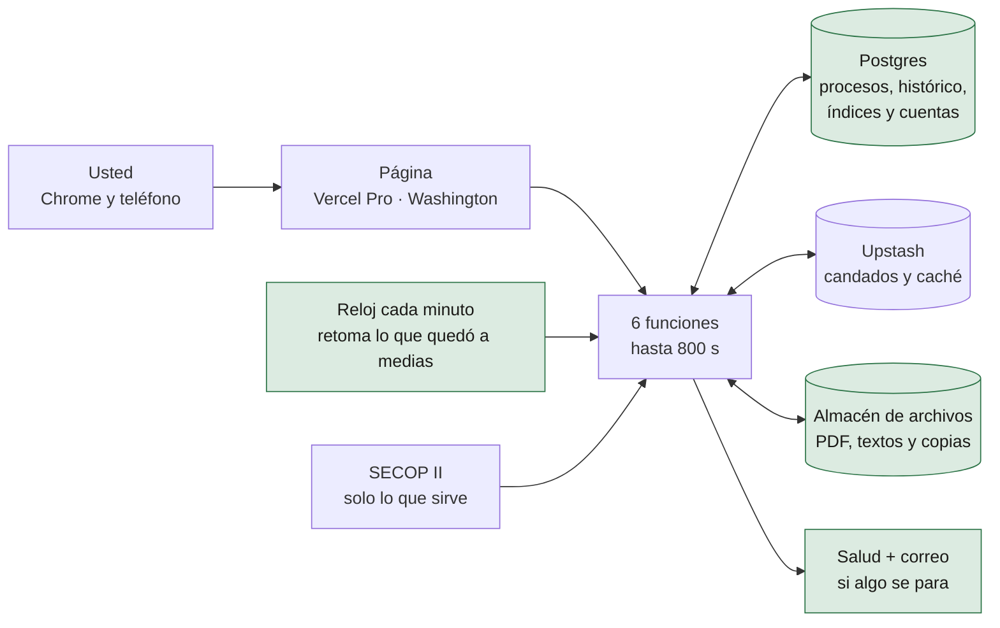
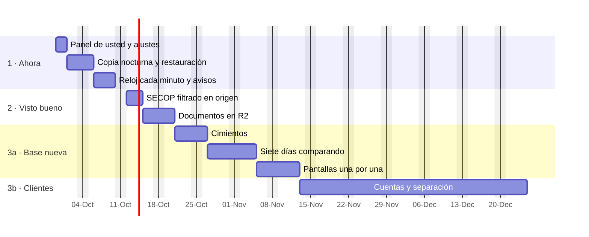

# Infraestructura de Detekta · lo que hay, lo que se propone y cuánto tarda llegar (27-sep-2026)

> Para: dueño · Estado: informe fechado · Sustituido por: —

Cómo se hizo: cinco auditores midieron el código por partes; siete investigadores leyeron hoy las páginas oficiales de
cada proveedor, y cada cifra que decide pasó por un verificador que intentó tumbarla; tres arquitectos propusieron
caminos distintos, tres jueces los calificaron y dos revisores leyeron este informe buscando errores. Producción y
SECOP se midieron desde aquí, solo leyendo. Lo técnico, las fuentes y lo que no se pudo medir están en el anexo (§ 10).

## 1. La respuesta corta

1. **No hace falta reescribir Detekta ni salir de Vercel.** La página y las funciones están bien elegidas para su
   tamaño; así trabajan también los sitios grandes (§ 7).
2. **Lo que falla es dónde viven los datos y cómo se cargan.** Redis se usa como base de datos para preguntas de base de
   datos («los procesos de esta entidad», «la mediana por departamento»), y las cargas largas dependen de una cadena de
   llamadas que se pierde. En septiembre eso se rompió cinco veces (§ 2).
3. **Lo más urgente no es de vanguardia.** La llave de acceso y el código de la puerta van escritos en la página misma
   (y el repositorio es público): quien sepa mirar el código los tiene. Y si el plan de Vercel es el gratuito, sus
   términos solo admiten uso personal no comercial: usarlo para su negocio ya cuenta como comercial, cobre o no.
4. **Tres etapas.** Etapa 1: endurecer sin mover datos ni cifras (unas dos semanas; US$ 20 a 41 al mes). Etapa 2: dos
   arreglos con su visto bueno. Etapa 3: decidir la base de datos ANTES de construir las cuentas de clientes, para no
   construirlas dos veces. Los jueces se dividieron en cuándo pasar a Postgres (§ 9, decisión 3).
5. **Mover los datos toma entre 10 minutos y hora y media de máquina (ESTIMADO) y no apaga el servicio.** Lo que toma
   tiempo es comprobar: siete días con las dos bases funcionando a la vez, dando las mismas cifras. Hasta tener las
   cuentas de clientes sobre la base nueva: unos tres meses de trabajo (SUPUESTO); para cobrar falta además lo del
   plan de acción (§ 5).

## 2. Lo que hay hoy

**Lo que ya se rompió en septiembre:**

| Qué pasó | Cuándo | Qué vio usted |
|---|---|---|
| El índice de baja creció a 12 MB y Upstash corta cada respuesta en 10 MB | 24 al 27-sep | Tres días sin «cuánto suelen bajar» ni «lo que deja» en todas las tarjetas |
| El detalle de competencia leía el histórico entero para UNA entidad | 14-sep | Error a los 60 s. Hoy el resumen sale al instante, pero la lista de procesos de la entidad se corta a los 35 s si no alcanza |
| La carga del histórico se quedó parada en el mes 17 de 33 | 15 al 25-sep | Competencia y baja calculadas sobre datos a medias, con la salud en verde |
| La carga del año se cortó en la fila 145.000 de 554.165 de enero, el primer mes de nueve | 26-sep | Hubo que terminarla desde GitHub; el primer botón además la devolvió a enero durante más de dos horas |
| El disparo de la tarde falló 19 veces seguidas por un secreto vacío, y llega 2 h 30 a 2 h 53 tarde | 7 al 25-sep | Si nadie abre la aplicación, un proceso de la mañana tarda 10 a 14 h en salir |

Dos cosas más, permanentes: **no existe ninguna copia del histórico fuera de Upstash**, y una parte no se puede volver a
bajar de SECOP (las señales de prórroga que la aplicación anota desde el 16-ago). Y **SECOP vuelve a sellar sus 9,2
millones de filas** (24 y 26-sep): cada vez, la actualización relee el año entero, porque Detekta no distingue una fila
que cambió de una que solo se volvió a sellar. Eso no lo arregla ningún proveedor: hace falta una marca por fila (§ 5).

## 3. Lo que se propone

| Pieza | Hoy | Propuesta |
|---|---|---|
| Plan de Vercel | Sin medir; el código supone el gratuito | **Pro**: US$ 20/mes con US$ 20 de crédito. Permite el uso comercial, un reloj por minuto y 800 s por función |
| Puerta | Llave y código de la puerta en la página | Un **muro de Vercel** (gratis o US$ 20/mes, § 9) hasta que existan las cuentas de clientes |
| Motor de cargas | Tandas que se llaman solas, y GitHub de respaldo | **Un reloj de Vercel que cada minuto revisa si quedó una carga a medias y la continúa** donde se quedó |
| Base de datos | Redis para todo | **Postgres** para procesos, histórico, índices y cuentas; Redis solo para candados y caché. La base busca y agrupa donde están los datos y la función recibe solo lo que va a mostrar |
| Archivos | No se guardan: cada PDF se vuelve a bajar en trozos de 3 MB | **Cloudflare R2**: cada PDF se baja una vez y se guarda; copia de los datos cada noche |
| Vigilancia | La salud existe, pero nada avisa | La salud se pone en rojo si un trabajo lleva 30 min quieto, y le llega un correo |
| Región | Washington | **Se queda en Washington**: desde Colombia responde en 74 ms; São Paulo, en 137 ms (medido hoy) |

Todo se habla por internet con `fetch`, como hoy con Upstash: producción sigue sin librerías de terceros. La página
instalable y más liviana en el teléfono es una mejora aparte, sin estimar aquí.

## 4. Qué mejora para usted

**Etapa 1, en unas dos semanas, sin mover datos ni cifras:**

| Hoy | Después |
|---|---|
| Las cargas largas se cortan y se terminan desde GitHub | Terminan solas; si algo se para 30 min, le llega un correo |
| Un proceso nuevo puede tardar 10 a 14 h en aparecer | Se actualiza cada 30 min, de 6:00 a 22:00 (la frecuencia la decide usted). Cuando SECOP vuelve a sellar todo, esa vuelta tarda más, hasta que exista la marca por fila |
| Ninguna copia del histórico fuera de Upstash | Copia cada noche, con una restauración de prueba que debe dar 39.294 procesos analizados y 3.672 entidades |
| Quien sepa mirar el código de la página entra | Muro de Vercel hasta que existan cuentas |
| Dos estudios previos escaneados (146 páginas) sin leer | Se leen con la clave gratuita de OCR |
| Un fallo de madrugada deja rastro una hora | Rastro de 30 días y aviso por correo |

**Etapas 2 y 3, con la base nueva y los documentos guardados:**

| Hoy | Después |
|---|---|
| Para ver UNA entidad se lee el histórico y la lista se corta a los 35 s | La base busca solo esa entidad: en una prueba local respondió en menos de una décima de segundo (falta medirlo en el servicio real y con el histórico completo) |
| Un índice que crece puede volver a no caber (ya pasó) | Los índices son tablas: nada se trae entero |
| Cada carga baja el 100 % de SECOP para usar el 9 % | Se pide solo lo que sirve: 11 veces menos filas (medido: igual resultado en agosto, 10.404 de 10.404) |
| PDF de más de 20 MB no se leen (30 de 438 pliegos) | Se bajan una vez y se guardan, sin tope |
| El dictamen lee los primeros 409.600 caracteres del pliego | Lee el pliego entero y los estudios previos |
| Un cliente separado de otro solo por el código | La base misma se niega a entregar datos de otra empresa |
| Si se pierde la base, se vuelve como mucho a la copia de ayer | Se vuelve a cualquier instante de los últimos 7 días, y además a las copias de R2 |

## 5. Cuánto tarda

### 5.1 Mover los datos

| Qué | Cuánto | Cómo | Tiempo de máquina |
|---|---|---|---|
| Histórico con sus señales de prórroga | 236.000 a 464.000 filas (SUPUESTO) | Se COPIA desde Upstash y se escribe en la base nueva | 3 a 27 min (SUPUESTO: esas dos velocidades no se pudieron medir) |
| Histórico, para comparar | 448.638 filas útiles de 5.020.853 | Se relee de SECOP | Con el filtro, 1 a 3 min (MEDIDO; una de dos descargas enteras se cortó, así que va mes a mes con reintento). Sin él, 18 a 42 min (calculado con velocidades medidas) |
| Procesos del año | 1.415.536 filas recorridas | Se reconstruyen de SECOP | 5 a 12 min (calculado con velocidades medidas) |
| Índices | competencia, baja, equivalencias | Se recalculan con las mismas reglas | ≈ 2 min 15 s (MEDIDO en producción) |
| Sus datos (registro, perfiles, precios, Mis procesos) | kilobytes | La exportación que ya existe | segundos |

**Total: entre 10 minutos y hora y media, sin apagar el servicio.** Upstash sigue siendo la verdad mientras tanto.
Durante siete días las cinco pantallas que usan el histórico se calculan con las dos bases a la vez y se comparan;
después se pasan a la base nueva una por día hábil, y la que no cuadre vuelve a Upstash sin tocar las demás.

### 5.2 El trabajo

Una sesión es un encargo como este, con la suite en verde. Ritmo SUPUESTO: una sesión por día hábil.

| Etapa | Qué | Sesiones | Calendario |
|---|---|---|---|
| 1 · Ahora | Su media hora en el panel (§ 9); ajustes; copia nocturna con restauración; el reloj cada minuto; avisos | 6 a 9 | 2 semanas |
| 2 · Con su visto bueno | SECOP filtrado en origen; documentos guardados en R2 | 5 a 7 | 1,5 semanas |
| 3a · Base nueva | Cimientos; siete días comparando; pantallas una por una; retiro de lo viejo | 14 a 20 | 4 a 5 semanas |
| 3b · Cuentas de clientes | Cuentas y separación entre empresas, hechas una sola vez sobre la base nueva | 25 a 34 | 5 a 7 semanas |

**Hasta tener las cuentas de clientes sobre la base nueva: entre 50 y 70 sesiones, unos tres meses (SUPUESTO).** Si
quiere vender antes, las cuentas pasan delante de la base nueva. **Para poder cobrar faltan además**, del plan de
acción, lo jurídico (5 a 7 jornadas), el cobro en línea (9 a 13) y el lanzamiento (2 a 3), que allí figuran como
bloqueadores, y trámites de afuera como la autorización del INVIAS. Tampoco está estimada aquí la marca por fila que
evita releer el año cuando SECOP vuelve a sellar todo.

## 6. Cómo hacerlo bien

- **Primero la copia, después la mudanza.** Lo que no se recupera sale fuera la primera semana, con una restauración
  probada y anotada.
- **Las dos bases a la vez, comparando cifras.** Misma entrada, misma cifra. Antes se cuentan los procesos con dos
  versiones de la misma fecha, y usted decide cuál gana.
- **Un interruptor por pantalla.** Si una falla, vuelve a leer de Upstash sin tocar las demás.
- **Las reglas se llaman, no se reescriben.** La mediana, el desempate y los filtros siguen siendo los de hoy; la base
  solo entrega las filas.
- **Nada que mueva una cifra sin plan escrito, su visto bueno y una revisión de alguien que no lo escribió.**
- **Si algo toca un tope, se dice.** «No sé» nunca se lee como «no hay».

## 7. Lo que NO se propone, y por qué

| Idea | Por qué no |
|---|---|
| Microservicios o Kubernetes | Es trabajo de equipos: Segment juntó sus 140 servicios en uno porque mantenerlos ocupaba a tres ingenieros. OpenAI atiende 800 millones de usuarios con un solo Postgres principal y unas 50 réplicas |
| Salir de Vercel | Ningún dolor lo exige; las seis funciones ya se probaron fuera de Vercel sin cambios |
| Mudarse a São Paulo | Más lejos en red desde Colombia (137 frente a 74 ms) y cómputo cerca de 1,7 veces más caro |
| Vercel Workflows | Está disponible, pero exige librerías y un paso de construcción |
| Pagar topes más grandes en Upstash (US$ 80 o 200 al mes) | Tapa el síntoma; el índice seguiría creciendo |
| Rehacer la página con un framework | Las pruebas leen el texto de la página en 232 sitios; sería lo más caro y no quita ningún dolor medido |
| Vender la IA con su suscripción de Claude | Los términos de Anthropic no lo permiten (§ 9, decisión 5) |

## 8. Cuánto cuesta al mes

TRM del 26 al 28-sep-2026: 3.306,86 pesos por dólar. El consumo de Vercel por encima del crédito no está medido.

| Momento | Qué se paga | US$/mes | Pesos/mes |
|---|---|---|---|
| Hoy | Plan sin medir. Si es el gratuito, 0, pero no admite uso comercial | 0 a ? | — |
| Etapa 1 | Vercel Pro 20 + Upstash por uso 0 a 1 + R2 0 (10 GB gratis) + OCR 0 + correo (precio sin verificar hoy). Muro gratis | 20 a 21 | 66.137 a 69.444 |
| Etapa 1 con muro de contraseña | Lo anterior + 20 | 40 a 41 | 132.274 a 135.581 |
| Base nueva, solo usted | Vercel Pro 20 + base nueva 3 a 6 + Upstash 0 a 1 | 23 a 27 | 76.058 a 89.285 |
| 10 clientes | Lo anterior con más uso | 29 a 42 | 95.899 a 138.888 |
| 100 clientes | Lo anterior con más uso: 0,42 a 1,01 dólares por cliente | 42 a 101 | 138.888 a 333.993 |
| IA para 100 clientes | Por la API de Claude, ≈ US$ 0,3 a 0,4 por dictamen (ESTIMADO) y 10 dictámenes por cliente al mes (SUPUESTO; ya se pueden contar con `op=uso`) | ≈ 350 | ≈ 1.157.401 |

**Con 100 clientes la infraestructura cuesta de 0,42 a 1,01 dólares al mes por cliente (unos 1.400 a 3.300 pesos); la
IA, unos 3,50 dólares por cliente (unos 11.600 pesos).** El precio de la suscripción lo fija la IA, no la base de datos.

## 9. Lo que decide usted

**Pasos en el panel (unos 30 a 60 minutos).** Los nombres de los botones salen de la documentación de hoy; su panel no
se vio desde aquí.

1. **Vercel**, en `https://vercel.com/` → su proyecto → «Settings» → «Billing»: pasar a **Pro**. En «Spend
   Management», un tope de US$ 50 con aviso por correo, **sin** pausar el proyecto (pausarlo apaga producción: decisión
   del 4-sep).
2. En «Settings» → «Functions», mire si **Fluid Compute** está encendido (es un interruptor), y tome una captura de esa
   página y del plan para la próxima sesión.
3. **OCR**: en `https://ocr.space/ocrapi` → «Register for free API key»; la clave llega a su correo. En Vercel,
   «Settings» → «Environment Variables» → «Add New»: `OCRSPACE_API_KEY`.
4. **Correo de avisos**: en `https://resend.com/`, cree una clave y pegue en Vercel `CORREO_API_KEY`,
   `CORREO_REMITENTE` (una dirección de un dominio suyo, verificado en Resend) y `CORREO_DESTINO`.
5. «Deployments» → «…» → «Redeploy». Luego abra `https://portafolio-estrategico.vercel.app/api/procesos?op=salud` y
   compruebe que «aviso_por_correo» diga `"configurado": true`.
6. **Upstash**, en `https://console.upstash.com/`: anote plan y región (captura), pase a pago por uso si está en el
   gratuito y encienda «Daily Backup».
7. **La puerta, el mismo día de la primera sesión y no antes.** En Vercel, «Security» → «Deployment Protection»:
   primero, en «Protection Bypass for Automation», cree el pase para las cargas automáticas; sin él, el muro corta las
   cargas y los botones de GitHub. Después elija el muro (decisión 2). La sesión pone el pase en GitHub y prueba una
   carga completa antes de dar el paso por terminado.
8. **Cloudflare R2**, para la copia nocturna: abra una cuenta en `https://dash.cloudflare.com/`; la sesión le dirá qué
   pegar.

**Decisiones:**

1. **Frecuencia de la actualización.** La propuesta: cada 30 min, de 6:00 a 22:00, hora de Colombia.
2. **El muro.** (a) **Vercel Authentication** en «All Deployments», gratis desde el 9-sep-2026: solo entran personas con
   cuenta de Vercel y acceso al proyecto. (b) **Password Protection**, US$ 20/mes: una contraseña que usted comparte.
   Las dos cierran también la entrada de visitantes nuevos. La salida de fondo son las cuentas de clientes (etapa 3b),
   que ya están escritas y apagadas; al encenderlas, la llave actual se cambia.
3. **Base nueva: sí o no, y cuándo.** Dos de los tres jueces (el que pensó como usted y el de ingeniería) recomiendan
   endurecer primero y decidir después con una regla medida: por ejemplo, si hacen falta más de dos índices nuevos por
   trimestre o si recalcularlos tarda más de 10 minutos. El tercero (el de negocio) recomienda hacerlo ya si piensa
   vender en unos tres meses. Los tres coinciden en que se decide ANTES de empezar las cuentas. Mi recomendación, por
   su objetivo de escalar y vender: pasar a Postgres al terminar la etapa 2.
4. **Cómo se conecta a Postgres.** (a) **Neon por internet, sin librerías**, comprado desde el Marketplace de Vercel
   (una sola factura, Washington). Riesgo: Neon no promete mantener esa forma de conexión; si la cambia, Detekta deja
   de funcionar hasta que una sesión lo arregle, y usted no puede arreglarlo desde el panel. Una prueba diaria avisaría
   el mismo día, y otros dos proveedores (Xata y PlanetScale) hablan igual. (b) **La receta de Vercel**: las librerías
   `pg` y `@vercel/functions`, con `package.json` y Fluid Compute encendido. (c) **Supabase**: conexión documentada y
   estable, pero cada consulta se escribe como función de la base y cuesta más. Recomendación: (a). Y una decisión
   ligada: para que las pruebas corran sin internet hace falta un Postgres de pruebas de 17,5 MB dentro del
   repositorio, o usar el del sistema en GitHub.
5. **IA para clientes.** La página oficial de Anthropic dice: «Anthropic does not permit third-party developers to
   offer Claude.ai login into their own applications, or to route requests through Free, Pro, or Max plan credentials
   on behalf of their users». Su suscripción sirve para su propio uso; para vender dictámenes o precios hace falta una
   clave de API, con su costo (§ 8), o no venderlos.
6. **SECOP filtrado en origen.** Baja 11 veces menos, pero es un filtro que podría esconder procesos si se hace mal:
   va con plan, comparación en tres meses y su visto bueno. Diga también si «Subasta de prueba» (719 filas) debe seguir
   pasando, como hoy.

## 10. Anexo para el ingeniero

### 10.1 Lo que exige cualquier mudanza

- Contar antes los procesos con dos versiones de igual `:updated_at` y distinto contenido: hoy los desempata el orden
  en que llegan del SCAN (`lib/almacen.leerChunksDedup`, «>=»). La regla se saca a una función pura que Upstash y
  Postgres LLAMAN.
- No alargar ninguna tanda mientras la actualización guarde en memoria las filas que descarta: 2.683 bytes por fila
  leída; con 800 s rondaría los 4 GB de una función de Pro. La suite fija `PRESUPUESTO_MAX_MS` por debajo del candado
  de 300 s.
- El prefiltro de SECOP va como EXCLUSIÓN generada llamando a `modalidad_competitiva` («modalidad vacía o no
  excluida»), con la lista en JS mandando.
- En Postgres, la fila se guarda como `json` y no `jsonb` (318 de 318 filas idénticas byte a byte frente a 0 de 318,
  medido por un arquitecto en PGlite), sin `coalesce(x, 0)` y con un rol de la aplicación que no se salte la seguridad
  por fila. El cliente falla en voz alta si una respuesta toca un tope.
- Toda prueba nueva tiene que fallar contra el árbol anterior (mutación). Lo que mueve una cifra, además, revisión
  adversaria.
- El detalle de una entidad hoy no se corta por `maxDuration`: su recorrido tiene un techo propio de 35 s
  (`DETALLE_PRESUPUESTO_MS`) y sirve primero lo publicado (`publicado=1`).

### 10.2 Lo que dicen los grandes y la literatura

El serverless rinde con peticiones cortas que llegan a ráfagas (Eismann y otros, 89 casos, 2020; Shahrad y otros,
Azure, 2020) y la base de datos es la parte difícil (Berkeley, 2019). Traer los datos al código en vez de calcular donde
están es un antipatrón (Hellerstein y otros, CIDR 2019): es exactamente el dolor de Detekta. Stack Overflow usó Redis
como caché y la base relacional como verdad. OpenAI sirve ChatGPT con un Postgres principal y unas 50 réplicas, y saca
a otro sistema las cargas de mucha escritura. «Elija tecnología aburrida» (McKinley, 2015): Postgres es la aburrida.

### 10.3 Medido, supuesto y no verificable

**Medido hoy (27-sep-2026)**: SECOP con 9.231.205 filas, todas re-selladas el 26-sep con el mismo `:updated_at`;
50.000 filas en 10,6 s desde aquí; el histórico útil (448.638 filas) en 66 s de una vez o 120 s de transferencia mes a
mes (160 s de reloj; una de dos descargas enteras se cortó y falló una de 34 peticiones mensuales); agosto filtrado
igual al de la aplicación (10.404); la salud de producción respondía bien, con la última actualización completa 18 h
antes y 39.294 procesos analizados (esa señal no detecta una carga a medias); funciones en Washington; repositorio
público sin muro; límites y precios de Vercel, Upstash, Neon, Supabase, R2 y OCR.space en sus páginas oficiales; la
protección gratuita de Vercel del 9-sep; latencias desde seis sondas colombianas; los términos de Anthropic; la TRM.

**Supuesto**: el tamaño del histórico en Upstash; la velocidad de copiar desde Upstash y de escribir en la base nueva;
el ritmo de una sesión por día; el costo de la base nueva y de la IA por dictamen; que la actualización cada 30 min
cabe en el crédito de Pro; los tiempos locales de Postgres (56.872 filas de obra, 51.976 procesos, sin red).

**No verificable desde aquí**: el plan de Vercel, si Fluid Compute está encendido, el plan y la región de Upstash, la
latencia real de Vercel a Upstash y de Vercel a Neon, el consumo del panel «Usage», si la llave escrita en la página es
la de producción, el precio de Resend y los nombres exactos de los botones de su panel.

### 10.4 Fuentes (leídas el 27-sep-2026)

- Vercel: uso comercial `https://vercel.com/docs/limits/fair-use-guidelines`; Pro `https://vercel.com/docs/plans/pro-plan`;
  límites `https://vercel.com/docs/functions/limitations`; reloj `https://vercel.com/docs/cron-jobs/usage-and-pricing`;
  muro `https://vercel.com/docs/deployment-protection/usage-and-pricing` y
  `https://vercel.com/changelog/protect-production-deployments-for-free-on-every-plan`; Fluid
  `https://vercel.com/docs/fluid-compute`; regiones `https://vercel.com/docs/regions`; Neon en el Marketplace
  `https://vercel.com/marketplace/neon`; Postgres con `pg` `https://vercel.com/kb/guide/connection-pooling-with-functions`.
- Upstash: `https://upstash.com/pricing/redis` y `https://upstash.com/docs/redis/help/production-checklist`.
- Neon: `https://neon.com/pricing` y `https://neon.com/docs/postgres/backup-restore/history-window`.
- Supabase: `https://supabase.com/pricing`. Cloudflare R2: `https://developers.cloudflare.com/r2/pricing/`.
  OCR.space: `https://ocr.space/ocrapi`.
- Anthropic: `https://code.claude.com/docs/en/legal-and-compliance`.
- GitHub (flujos programados en repositorios públicos):
  `https://docs.github.com/en/actions/how-tos/manage-workflow-runs/disable-and-enable-workflows`.
- Literatura: `https://arxiv.org/abs/1812.03651` (Hellerstein);
  `https://www2.eecs.berkeley.edu/Pubs/TechRpts/2019/EECS-2019-3.pdf` (Berkeley); `https://arxiv.org/abs/2008.11110`
  (Eismann); `https://www.usenix.org/conference/atc20/presentation/shahrad` (Shahrad);
  `https://www.twilio.com/en-us/blog/developers/best-practices/goodbye-microservices` (Segment);
  `https://mcfunley.com/choose-boring-technology` (McKinley);
  `https://nickcraver.com/blog/2016/02/17/stack-overflow-the-architecture-2016-edition/` (Stack Overflow);
  `https://openai.com/index/scaling-postgresql/` (OpenAI; su servidor respondió 403 y se leyó por un lector intermedio).
- Latencia desde Colombia: `https://wondernetwork.com/pings/Bogota` y Globalping (seis sondas de ETB, Claro/Telmex,
  EdgeUno y otras).
- SECOP II: `https://www.datos.gov.co/resource/p6dx-8zbt.json`. TRM: `https://www.datos.gov.co/resource/32sa-8pi3.json`.
- En el repositorio: `docs/ARQUITECTURA_MULTITENANT.md § «4. MODELO DE CAPACIDAD»`,
  `docs/PLAN_DE_ACCION.md § «RESUMEN DE ESFUERZO»`,
  `docs/MEMORIA.md § «El 504 del modal de competencia»` y
  `docs/MEMORIA.md § «Lo que la lista enseñaba mal: el índice que ya no cabía»`.
