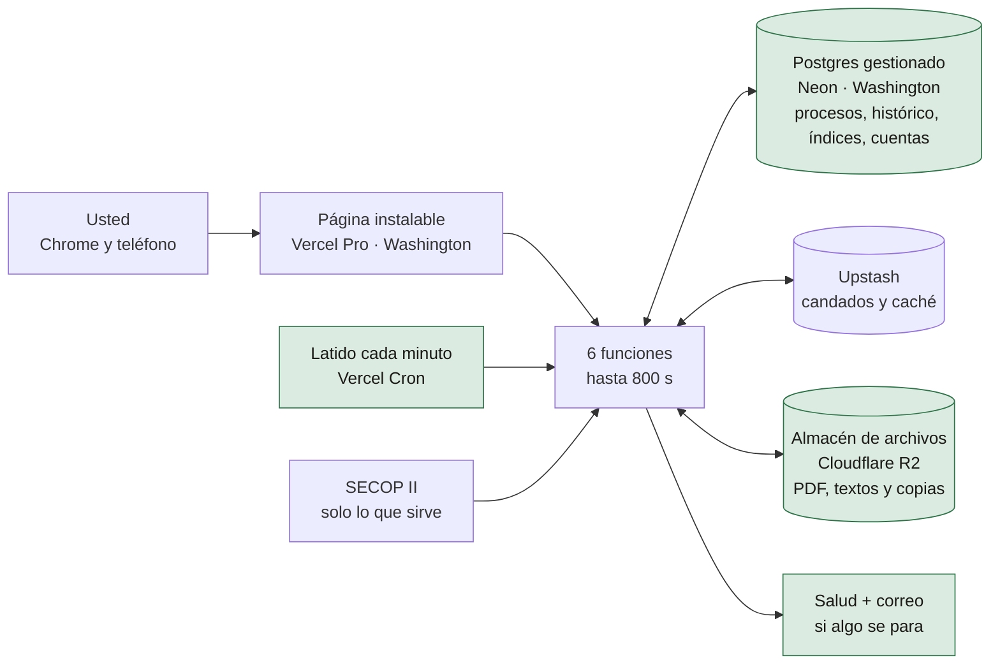
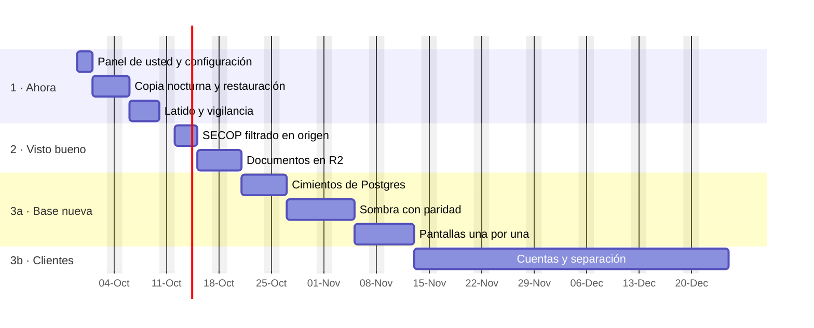

# Infraestructura de Detekta · lo que hay, lo que se propone y cuánto tarda llegar (27-sep-2026)

> Para: dueño · Estado: informe fechado · Sustituido por: —

Cómo se hizo: cinco auditores leyeron y midieron el código por partes, siete investigadores leyeron hoy las páginas
oficiales de cada proveedor (cada cifra que decide pasó por un verificador que intentó tumbarla), tres arquitectos
propusieron caminos distintos y tres jueces los calificaron. Producción y SECOP se midieron desde aquí, solo leyendo.
Lo que no se pudo medir está dicho en § 10. Continúa el análisis de `docs/ARQUITECTURA_MULTITENANT.md` (24-ago) y no lo
contradice: lo actualiza con lo que pasó en septiembre.

## 1. La respuesta corta

1. **No hace falta reescribir Detekta ni cambiar de Vercel.** La web y las funciones están bien elegidas para su
   tamaño; así trabajan también los sitios grandes (§ 7).
2. **Lo que falla es la base de datos y el motor de cargas.** Redis se usa como base de datos para preguntas que son
   de base de datos («los procesos de esta entidad», «la mediana por departamento»), y las cargas largas dependen de
   una cadena de llamadas que se pierde. En septiembre eso ya se rompió cinco veces (§ 2).
3. **Lo más urgente no es de vanguardia**: la llave de acceso está escrita en el código de un repositorio público y no
   hay muro de contraseña; y si el plan de Vercel es el gratuito (Hobby), sus términos prohíben cobrar.
4. **La propuesta tiene tres etapas**: endurecer sin mover datos (dos semanas), dos arreglos con su visto bueno, y una
   base de datos relacional (Postgres) antes de construir las cuentas de clientes, para no construirlas dos veces.
5. **El traslado de los datos tarda menos de una hora de máquina** (medido: el histórico útil baja de SECOP entero en
   66 a 120 segundos). Lo que toma tiempo es comprobar: siete días con las dos bases en paralelo, dando las mismas
   cifras, sin apagar el servicio ni un minuto.

## 2. Lo que hay hoy

**Lo que ya se rompió, con fecha (todo medido o registrado en la memoria):**

| Qué pasó | Cuándo | Qué vio usted | Causa de fondo |
|---|---|---|---|
| El índice de baja creció a 12 MB y Upstash corta cada respuesta en 10 MB | 24 al 27-sep | Tres días sin «cuánto suelen bajar» ni «lo que deja» en el 100 % de las tarjetas | Un índice que crece con el corpus, leído entero |
| El modal de competencia leía el histórico entero para UNA entidad | 14-sep | Error 504 a los 60 s | Redis no tiene índices por entidad |
| La extracción del histórico se quedó parada en el mes 17 de 33 | 15 al 25-sep | Competencia y baja calculadas sobre datos a medias, con la salud en verde | La cadena de llamadas se pierde y nadie avisa |
| La carga completa se cortó en la fila 145.000 de 554.165 | 26-sep | Hubo que terminarla con un botón de GitHub | La misma cadena |
| El disparo de la tarde falló 19 veces seguidas por un secreto vacío, y llega 2 h 30 a 2 h 53 tarde | 7 al 25-sep | Si nadie abre la aplicación, un proceso de la mañana puede tardar 10 a 14 h en salir | GitHub como reloj |

Además, sin fecha porque es permanente: **no existe ninguna copia del histórico fuera de Upstash**, y una parte no se
puede volver a bajar de SECOP (las señales de prórroga que la aplicación anota desde el 16-ago). Explicar la probabilidad
de un proceso viejo cuesta 86 comandos y 5,1 MB para encontrar una fila (medido con el doble de la suite y 40.000
procesos).

## 3. Lo que se propone

| Pieza | Hoy | Propuesta | Por qué |
|---|---|---|---|
| Plan de Vercel | Sin medir (el código supone Hobby) | **Pro**, US$ 20/mes con US$ 20 de crédito | Hobby es «non-commercial personal use only»; Pro da reloj por minuto y 800 s |
| Puerta | Llave en el código público, sin muro | **Muro de Vercel** (US$ 20/mes) hasta que existan cuentas | Cualquiera con la dirección entra hoy |
| Motor de cargas | Tramos que se llaman solos + GitHub | **Latido cada minuto** que retoma desde el cursor y el candado que ya existen | Deja de depender de una llamada que se pierde |
| Base de datos | Redis para todo | **Postgres** para procesos, histórico, índices y cuentas; Redis solo candados y caché | La base busca y agrupa donde están los datos; la función recibe solo lo que va a mostrar |
| Archivos | No se guardan: cada PDF se vuelve a bajar en trozos de 3 MB | **Cloudflare R2**: el PDF se baja una vez; copias nocturnas | Sin tope de 20 MB; egreso gratis; la firma se escribe sin librerías (reproducida con el vector oficial; falta probarla contra un almacén real) |
| Vigilancia | La salud existe, pero nadie la escucha | Salud en rojo si un trabajo lleva 30 min quieto + correo (`lib/correo.js` ya está escrito) | Enterarse antes que el cliente |
| Región | Washington | **Se queda en Washington** | Desde Colombia: 74 ms a Washington, 137 ms a São Paulo (medido hoy) |

Todo se habla por `fetch`, como hoy con Upstash: la regla de cero dependencias se conserva en producción (§ 9 dice
dónde hay una decisión suya).

## 4. Qué mejora para usted

**En las primeras dos semanas (etapa 1, sin mover datos ni cifras):**

| Hoy | Después |
|---|---|
| Las cargas largas se cortan y se terminan con un botón de GitHub | Terminan solas; si algo se para 30 min, la salud se pone en rojo y le llega un correo |
| Un proceso nuevo puede tardar 10 a 14 h en aparecer | Se actualiza cada 30 min en horario hábil (la frecuencia la decide usted) |
| Ninguna copia del histórico fuera de Upstash | Copia cada noche, con una restauración de prueba que debe dar 39.294 procesos analizados y 3.672 entidades |
| Cualquiera con la dirección ve sus cifras | Muro de contraseña hasta que existan cuentas |
| El modal de competencia se corta a los 60 s | 300 s: con Fluid Compute encendido, el tope de 60 lo pone la configuración propia, no el plan |
| Dos estudios previos escaneados (146 páginas) sin leer | Se leen: basta pegar la clave de OCR, el plan gratuito alcanza y admite uso comercial |
| Un fallo de madrugada deja rastro una hora | Rastro de 30 días y aviso |

**Después (etapas 2 y 3):**

| Hoy | Después |
|---|---|
| Para UNA entidad se leen 3,6 a 4,8 MB y se usan 11 procesos (prueba con 40.000 procesos) | La base responde por índice: 0,4 a 50 ms por consulta (medido en Postgres local con 56.872 procesos reales de obra) |
| Un índice que crece puede volver a no caber (ya pasó) | Los índices son tablas: ninguna respuesta tiene que traerlos enteros |
| Cada carga baja el 100 % de SECOP para usar el 9 % | Se pide solo lo que sirve: 11 veces menos filas, y el histórico útil entero en 66 a 120 s (medido; mismo resultado exacto en agosto: 10.404 = 10.404) |
| PDF de más de 20 MB no se leen (30 de 438 pliegos); uno de 12 MB cuesta 4 descargas | Se bajan una vez y se guardan, sin tope |
| El dictamen lee los primeros 409.600 caracteres del pliego | Lee el pliego entero y los estudios previos |
| Un cliente separado de otro solo por el código | La base misma se niega a entregar filas ajenas (probado por un arquitecto en un Postgres de prueba) |
| Ninguna copia fuera; la copia diaria de Upstash guarda 1 día y solo existe en planes de pago | Volver a cualquier instante de los últimos 7 días, más las copias en R2 |
| La portada pesa 639 KB comprimida y tarda 3,6 s en un teléfono simulado | Página instalable, que no revalida 20 archivos en cada visita (mejora aparte, sin build) |

## 5. Cuánto tarda

### 5.1 El traslado de los datos

| Qué | Cuánto | Cómo | Tiempo de máquina |
|---|---|---|---|
| Histórico con sus señales de prórroga | 236.000 a 464.000 filas, 80 a 160 MB comprimidos (SUPUESTO) | Se COPIA desde Upstash: SECOP no devuelve las señales | 3 a 19 min |
| Histórico, para comparar | 448.638 filas útiles de 5.020.853 | Se relee de SECOP filtrado en origen | 66 a 120 s (MEDIDO) |
| Procesos del año | 1.415.536 filas recorridas | Se reconstruyen de SECOP | 5 a 12 min (MEDIDO: 2.000 a 4.700 filas/s) |
| Índices | competencia, baja, equivalencias | Se recalculan con las mismas reglas de hoy | ≈ 2 min 15 s (MEDIDO en producción) |
| Sus datos (registro, perfiles, precios, Mis procesos) | kilobytes | La exportación que ya existe | segundos |

**Total: menos de una hora de máquina, sin ventana sin servicio.** Upstash sigue siendo la verdad hasta que cada
pantalla, una por una, pase siete días dando las mismas cifras desde la base nueva.

### 5.2 El trabajo

Una sesión es un pull request con la suite 4/4. Ritmo SUPUESTO: una sesión por día hábil.

| Etapa | Qué | Sesiones | Calendario | ¿Mueve una cifra que decide? |
|---|---|---|---|---|
| 1 · Ahora | Su media hora en el panel; configuración; copia nocturna con restauración; latido; vigilancia | 6 a 9 | 2 semanas | No |
| 2 · Con su visto bueno | SECOP filtrado en origen; documentos en R2 | 5 a 7 | 1,5 semanas | Sí: plan escrito antes |
| 3a · Base nueva | Cimientos; siete días en sombra con paridad; pantallas una por una; retiro de lo viejo | 14 a 20 | 4 a 5 semanas | Sí, con paridad exacta |
| 3b · Cuentas y separación entre clientes | Lo que `docs/PLAN_DE_ACCION.md` ya pide para vender, hecho sobre la base nueva | 25 a 34 | 5 a 7 semanas | Sí |

**Hasta tener Detekta lista para cobrar sobre la base nueva: entre 50 y 70 sesiones; a una por día hábil, unos tres
meses (SUPUESTO).** Si quiere vender antes, las cuentas (3b) pasan delante de la sombra. El multiusuario cuesta casi lo
mismo sobre cualquier base: el plan de acción lo mide en 27 a 36 jornadas. Hacerlo primero sobre
Redis y después migrar costaría 6 a 9 sesiones más (SUPUESTO del arquitecto de la opción Postgres).

## 6. Cómo hacerlo bien

- **Primero la copia, después la mudanza.** Lo único irrecuperable (las señales de prórroga) se copia fuera la primera
  semana, con una restauración probada y anotada con fecha.
- **En sombra y con paridad.** La base nueva recibe lo mismo que Upstash y se compara pantalla por pantalla: misma
  entrada, misma cifra. Antes se cuentan los procesos con dos versiones de la misma fecha (hoy los desempata el orden en
  que Redis los devuelve) y usted fija la regla.
- **Un interruptor por pantalla**, en este orden: el detalle de un proceso, el de una entidad, los índices, la lista y
  la baja. Si una falla, vuelve a leer de Upstash sin tocar las demás.
- **Las reglas no se reescriben: se llaman.** La mediana, el desempate de versiones y la cascada de filtros siguen
  siendo las funciones de hoy; la base entrega las filas.
- **Toda prueba nueva tiene que fallar contra el árbol anterior** (mutación), y lo que mueve una cifra lleva plan
  escrito, su visto bueno y una revisión adversaria.
- **Nada de tramos más largos** hasta que la carga deje de guardar en memoria las filas que descarta: hoy son 2.683
  bytes por fila y, con 800 s, rozaría los 4 GB de una función.
- **Fallar en voz alta.** Si una respuesta toca un tope (10 MB, 1.000 filas, lo que sea), el error se dice: «no sé»
  nunca se lee como «no hay».

## 7. Lo que NO se propone, y por qué

| Idea | Por qué no |
|---|---|
| Microservicios o Kubernetes | Es trabajo de equipos: Segment juntó sus 140 servicios en uno porque mantenerlos ocupaba a tres ingenieros. OpenAI atiende 800 millones de usuarios con un solo Postgres principal y unas 50 réplicas (y saca a otro sistema lo que escribe mucho) |
| Salir de Vercel | Ningún dolor lo exige; los seis routers ya corren fuera de Vercel sin cambios (plan B probado) |
| Mudarse a São Paulo | Queda más lejos de Colombia en red (137 frente a 74 ms) y el cómputo cuesta cerca de 1,7 veces más |
| Vercel Workflows | Está disponible, pero exige paquete npm y paso de construcción |
| Comprar el tope de 50 MB de Upstash (US$ 80/mes) o el Prod Pack (US$ 200/mes) | Tapa el síntoma; el índice seguiría creciendo |
| QStash como relevo | Suma un proveedor y tres secretos; el latido de Vercel hace lo mismo con lo que ya existe. Queda como plan B |
| Supabase como plataforma todo en uno | Válida, pero con más gasto fijo desde el primer día y base, archivos, cuentas y copias en un solo proveedor. Queda como plan B |
| Reescribir la página en un framework | La suite lee el texto de `public/` en 232 sitios: sería el trabajo más caro y no quita ningún dolor medido |
| Vender la IA con su suscripción de Claude | Los términos de Anthropic lo prohíben (§ 9, punto 5) |

La literatura dice lo mismo: el serverless rinde con peticiones cortas que llegan a ráfagas (Eismann y otros, 89 casos,
2020; Shahrad y otros, Azure, 2020) y la base de datos es la parte difícil (Berkeley, 2019); traer los datos al código
en vez de calcular donde están es un antipatrón (Hellerstein, CIDR 2019), y es exactamente el dolor de Detekta; Stack
Overflow usó Redis como caché y la base relacional como verdad; y «elija tecnología aburrida» (McKinley, 2015):
Postgres es la opción aburrida.

## 8. Cuánto cuesta al mes

TRM del 26 al 28-sep-2026: 3.306,86 COP por dólar. El consumo real de Vercel por encima del crédito no está medido.

| Momento | Qué se paga | US$/mes | COP/mes |
|---|---|---|---|
| Hoy | Plan sin medir. Si es Hobby, 0, pero no permite cobrar | 0 a ? | — |
| Etapa 1 | Vercel Pro 20 + muro 20 + Upstash por uso ≈ 0 a 1 + R2 0 (10 GB gratis) + OCR 0 + correo 0 | 40 a 41 | 132.274 a 135.581 |
| Base nueva, solo usted | Vercel Pro 20 + Neon ≈ 3 a 6 + Upstash ≈ 0 a 1 (+ muro 20 hasta tener cuentas) | 23 a 26 (43 a 46) | 76.058 a 85.978 |
| 10 clientes | Lo anterior con más uso | 29 a 42 | 95.899 a 138.888 |
| 100 clientes | Lo anterior con más uso | 42 a 101 | 138.888 a 333.993 |
| IA para clientes | Por la API de Claude: ≈ US$ 0,3 a 0,4 por dictamen (ESTIMADO, sin medir). Con 100 clientes y 10 dictámenes cada uno, ≈ US$ 350 | ≈ 350 | ≈ 1.157.401 |

**A 100 clientes la infraestructura cuesta menos de un dólar por cliente; lo que pesa es la IA.** Ese costo fija el
precio de la suscripción, no la base de datos.

## 9. Lo que decide usted

1. **Hoy, en el panel (unos 30 a 60 min).** En `https://vercel.com/` → su proyecto:
   «Settings» → «Billing»: pasar a **Pro**; en «Spend Management», un tope con aviso por correo **sin** pausar el
   proyecto (apagaría producción: decisión del 4-sep). «Settings» → «Functions»: anotar si **Fluid Compute** está
   encendido (interruptor de la página). «Settings» → «Deployment Protection»: encender **Password Protection** (US$ 20/mes). «Settings» →
   «Environment Variables»: pegar `OCRSPACE_API_KEY`. En `https://console.upstash.com/`: anotar plan y región, pasar a
   pago por uso y encender **Daily Backup**. (Los nombres de los botones salen de la documentación de hoy; su panel no
   se vio desde aquí.)
2. **Con qué frecuencia actualizar**: la propuesta es cada 30 min de 6:00 a 22:00, hora de Colombia.
3. **Base nueva sí o no, y cuándo.** Recomendación: sí, y antes de empezar las cuentas de clientes, si piensa vender en
   los próximos meses. Si no, la etapa 1 basta por ahora.
4. **Cómo se habla con Postgres.** (a) Neon por HTTP con `fetch`: cero dependencias, pero su protocolo no está
   publicado como estable (lo implementan también Xata y PlanetScale, y una prueba diaria avisaría). (b) Aceptar UNA
   dependencia aislada, el cliente `pg` que Vercel recomienda. (c) Supabase, con API pública pero consultas como
   funciones SQL y más costo. Recomendación: (a), comprada desde el Marketplace de Vercel para tener una sola factura.
5. **IA para clientes.** La página oficial de Anthropic dice: «Anthropic does not permit third-party developers to
   offer Claude.ai login into their own applications, or to route requests through Free, Pro, or Max plan credentials
   on behalf of their users». Su suscripción sirve para su propio uso; para vender dictámenes o precios hace falta una
   clave de API (con su costo, § 8) o no venderlos.
6. **SECOP filtrado en origen.** Es un filtro que podría esconder procesos si se hace mal: va con plan, paridad en tres
   meses y su visto bueno. Hoy la función deja pasar «Subasta de prueba» (719 filas): diga si debe seguir así.

## 10. Medido, supuesto y no verificable

**Medido hoy (27-sep-2026)**: SECOP con 9.231.205 filas, todas re-selladas el 26-sep con la misma fecha; 50.000 filas
en 10,6 s desde aquí; el histórico útil (448.638 filas) en 66 a 120 s; agosto filtrado igual al de la aplicación
(10.404); producción sana con 39.294 procesos analizados; funciones en Washington; repositorio público sin muro; los
límites y precios de Vercel, Upstash, Neon, Supabase, R2 y OCR.space en sus páginas oficiales; latencias desde seis
sondas colombianas; los términos de Anthropic; la TRM.

**Supuesto**: el tamaño del histórico en Upstash (236.000 a 464.000 filas); el ritmo de una sesión por día; los costos
de Neon y de la IA por dictamen; los tiempos de escritura en Neon; que el delta cada 30 min cabe en el crédito de Pro.

**No verificable desde aquí**: el plan de Vercel, si Fluid Compute está encendido, el plan y la región de Upstash, la
latencia real entre Vercel y Upstash, el consumo real del panel «Usage», si la llave del código abre producción, y los
nombres exactos de los botones de su panel.

## 11. Fuentes (leídas el 27-sep-2026)

- Vercel: planes y uso comercial `https://vercel.com/docs/limits/fair-use-guidelines` y `https://vercel.com/docs/plans/pro-plan`;
  límites `https://vercel.com/docs/functions/limitations`; reloj `https://vercel.com/docs/cron-jobs/usage-and-pricing`;
  muro `https://vercel.com/docs/deployment-protection/usage-and-pricing`; regiones `https://vercel.com/docs/regions`;
  Neon en el Marketplace `https://vercel.com/marketplace/neon`.
- Upstash: precios y topes `https://upstash.com/pricing/redis`; copias `https://upstash.com/docs/redis/help/production-checklist`.
- Neon: `https://neon.com/pricing` y `https://neon.com/docs/postgres/backup-restore/history-window`.
- Supabase: `https://supabase.com/pricing`. Cloudflare R2: `https://developers.cloudflare.com/r2/pricing/`.
  OCR.space: `https://ocr.space/ocrapi`.
- Anthropic: `https://code.claude.com/docs/en/legal-and-compliance`.
- GitHub, flujos programados en repositorios públicos:
  `https://docs.github.com/en/actions/how-tos/manage-workflow-runs/disable-and-enable-workflows`.
- Literatura: Hellerstein y otros, «Serverless Computing: One Step Forward, Two Steps Back», `https://arxiv.org/abs/1812.03651`;
  Berkeley, «Cloud Programming Simplified», `https://www2.eecs.berkeley.edu/Pubs/TechRpts/2019/EECS-2019-3.pdf`;
  Eismann y otros, `https://arxiv.org/abs/2008.11110`; Shahrad y otros, `https://www.usenix.org/conference/atc20/presentation/shahrad`;
  Segment, `https://www.twilio.com/en-us/blog/developers/best-practices/goodbye-microservices`;
  McKinley, `https://mcfunley.com/choose-boring-technology`;
  Stack Overflow, `https://nickcraver.com/blog/2016/02/17/stack-overflow-the-architecture-2016-edition/`;
  OpenAI, `https://openai.com/index/scaling-postgresql/` (su servidor respondió 403; se leyó por un lector intermedio).
- Latencia desde Colombia: `https://wondernetwork.com/pings/Bogota` y Globalping (seis sondas de ETB, Claro/Telmex,
  EdgeUno y otras).
- SECOP II: `https://www.datos.gov.co/resource/p6dx-8zbt.json`. TRM: `https://www.datos.gov.co/resource/32sa-8pi3.json`.
- En el repositorio: `docs/ARQUITECTURA_MULTITENANT.md § «4. MODELO DE CAPACIDAD»`,
  `docs/PLAN_DE_ACCION.md § «FASE 2 · AISLAMIENTO ENTRE CLIENTES»`, y la memoria en
  `docs/MEMORIA.md § «El 504 del modal de competencia»` y
  `docs/MEMORIA.md § «Lo que la lista enseñaba mal: el índice que ya no cabía»`.
